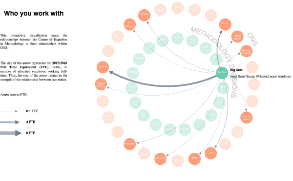

# Who you work with

The [Office for National Statistics (ONS)](https://www.ons.gov.uk/) Methodology Group leads on the statistical methods and techniques that underpin all ONS surveys and statistical outputs.

The data underpinning this [interactive](https://onsbigdata.github.io/Who-you-work-with/index.html) maps the [Centre of Expertise of the Methodology Group](https://www.ons.gov.uk/methodology/methodologycontacts) to their stakeholders within ONS to understand the relationships and priority of interactions between the two.

The size of the arrow represents the 2015/2016 [Full Time Equivalent (FTE)](https://en.wikipedia.org/wiki/Full-time_equivalent) metric, ie number of allocated employee working full-time to projects for/in collaboration with the stakeholder. Therefore, the size of the arrow is representative of the strength of the relationship between two nodes.

   
  

The interactive visualisation can be accessed at this [link](https://onsbigdata.github.io/Who-you-work-with/index.html), while the full code is published in this repository.

The visualisation was created using [D3.js v3](https://d3js.org/).

## Useful links

This interactive visualisation was cited in the [Independent review of Methodology](https://www.statisticsauthority.gov.uk/wp-content/uploads/2016/09/Independent-review-of-Methodology.pdf), published by the UK Statistics Authority and led by Dr Andrew Garrett on 29 September 2016.

## Contributors

[Alessandra Sozzi](https://github.com/AlessandraSozzi), working for the [Office for National Statistics Big Data project](https://www.ons.gov.uk/aboutus/whatwedo/programmesandprojects/theonsbigdataproject)

## LICENSE

Released under the [GNU General Public License, version 3](LICENSE).
